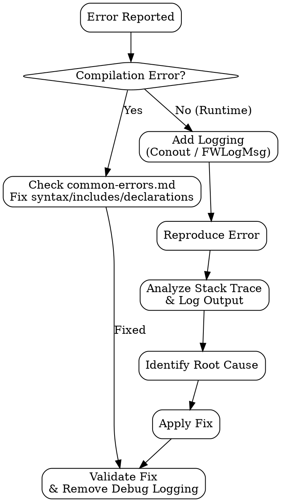

# ADVPL/TLPP Debugging

## Overview

Systematic methodology for diagnosing and resolving errors in ADVPL/TLPP on TOTVS Protheus. This skill covers compilation errors, runtime failures, performance bottlenecks, database locks, log analysis, and AppServer troubleshooting.

## When to Use

- Compilation errors (syntax, missing includes, undeclared variables)
- Runtime errors (NIL access, type mismatch, array bounds)
- Performance issues (slow queries, memory leaks, excessive loops)
- Database locks (RecLock timeouts, deadlocks, exclusive access failures)
- Log analysis (Protheus console, AppServer logs, SmartClient logs)
- AppServer issues (crash, high memory, thread exhaustion, connection problems)

## Debug Methodology



**Steps:**

1. **Error reported** - Collect the error message, stack trace, and reproduction steps
2. **Compilation?** - If yes, consult `common-errors.md` for immediate fix
3. **Add logging** - Insert Conout/FWLogMsg at strategic points around the failure
4. **Reproduce** - Recreate the error in a controlled environment
5. **Analyze stack** - Read the full stack trace, identify the failing line and function
6. **Identify root cause** - Determine why the error occurs (data, logic, environment)
7. **Fix** - Apply the correction, validate, and remove debug logging

## Quick Diagnosis by Error Type

| Symptom | Likely Cause | First Check |
|---------|-------------|-------------|
| Variable does not exist | Undeclared Local or typo in name | Verify variable declaration matches usage (case-sensitive) |
| Array access out of bounds | Index exceeds `Len(aArray)` or index <= 0 | Add `Conout(Len(aArray))` before the access line |
| Type mismatch on operation | Operating on NIL or wrong type | Check `ValType()` of both operands before the line |
| File not found / Include error | Missing .ch file or wrong RPO | Verify `#Include` paths and RPO compilation |
| Lock timeout (RecLock) | Record locked by another user/thread | Check `RecLock(cAlias, .F.)` with timeout, use SM0/SMA lock monitor |
| Memory allocation error | Array growing unbounded or object leak | Check loops for `aAdd` without limit, verify `FreeObj()` calls |
| Invalid alias XXXX | WorkArea not opened or closed prematurely | Verify `DbSelectArea()` precedes the alias usage, check `Select(cAlias) > 0` |

## Logging Tools

### Conout (Console Output)

Simple console logging. Output appears in the Protheus AppServer console.

```advpl
// Basic variable inspection
Conout(">>> [FATA001] cCodCli: " + cValToChar(cCodCli))
Conout(">>> [FATA001] nTotal: " + cValToChar(nTotal))
Conout(">>> [FATA001] ValType(xRet): " + ValType(xRet))

// Array inspection
Conout(">>> aItens length: " + cValToChar(Len(aItens)))
If Len(aItens) > 0
    Conout(">>> aItens[1]: " + cValToChar(aItens[1]))
EndIf

// Flow tracing
Conout(">>> Entering FATA001 at " + Time())
// ... code ...
Conout(">>> Leaving FATA001 at " + Time())
```

### FWLogMsg (Structured Logging - Preferred)

Structured logging with severity levels. Logs are stored in the Protheus log system and can be queried.

```advpl
// Severity levels: "INFO", "WARNING", "ERROR"
FWLogMsg("INFO", , "FATA001", "MyModule", "", 01, ;
    "Processing started for client: " + cCodCli)

FWLogMsg("ERROR", , "FATA001", "MyModule", "", 02, ;
    "Failed to lock record SA1. Alias: " + cAlias + ;
    " RecNo: " + cValToChar(RecNo()))

FWLogMsg("WARNING", , "FATA001", "MyModule", "", 03, ;
    "Slow query detected. Elapsed: " + cValToChar(nElapsed) + "s")
```

### ErrorBlock for Custom Stack Trace Capture

Capture and log full error details including the call stack.

```advpl
Local oError
Local bOldError := ErrorBlock({|e| oError := e, Break(e)})

Begin Sequence

    // Code that may fail
    DbSelectArea("SA1")
    DbSetOrder(1)
    DbSeek(xFilial("SA1") + cCodCli)
    cNome := SA1->A1_NOME

Recover Using oError
    Conout("=== ERROR CAPTURED ===")
    Conout("Description: " + oError:Description)
    Conout("GenCode:     " + cValToChar(oError:GenCode))
    Conout("SubCode:     " + cValToChar(oError:SubCode))
    Conout("OsCode:      " + cValToChar(oError:OsCode))
    Conout("FileName:    " + cValToChar(oError:FileName))
    Conout("Operation:   " + oError:Operation)
    Conout("Args:        " + cValToChar(oError:Args))
    Conout("======================")

End Sequence

ErrorBlock(bOldError)
```

## Database Lock Diagnosis

### RecLock with Timeout Check

Always use `.F.` (non-exclusive wait) and check the return value:

```advpl
DbSelectArea("SD1")
DbSetOrder(1)

If DbSeek(xFilial("SD1") + cDoc + cSerie)
    // Try to lock with .F. (non-blocking)
    If RecLock("SD1", .F.)
        SD1->D1_TOTAL := nNewTotal
        MsUnlock()
        Conout(">>> Record updated successfully")
    Else
        Conout(">>> ERROR: Could not lock SD1 RecNo " + cValToChar(RecNo()))
        Conout(">>> Another user/thread may be editing this record")
        // Check who is locking:
        // Use Protheus Monitor (SIGAMNT) or AppServer console
    EndIf
EndIf
```

### Common Lock Issues

| Issue | Cause | Fix |
|-------|-------|-----|
| RecLock hangs indefinitely | Using `RecLock(cAlias, .T.)` - blocks forever | Use `RecLock(cAlias, .F.)` and check return |
| Lock not released | Missing `MsUnlock()` after RecLock | Always call `MsUnlock()` after writing |
| Deadlock between threads | Two threads locking records in different order | Lock records in a consistent order, keep locks short |
| Exclusive lock failure | Another process has shared lock | Schedule exclusive operations during off-hours |

## Performance Quick Checks

### Wrong Index (DbSetOrder)

Using the wrong index forces a full table scan:

```advpl
// WRONG - may use wrong index or full scan
DbSelectArea("SA1")
DbSetOrder(3) // Index 3 may not match your search key
DbSeek(xFilial("SA1") + cCodCli)

// RIGHT - verify the index matches your key
// Check SIX table for SA1 index composition
// Index 1 typically: A1_FILIAL + A1_COD + A1_LOJA
DbSelectArea("SA1")
DbSetOrder(1)
DbSeek(xFilial("SA1") + cCodCli + cLoja)
```

### Array Growth in Loops

Pre-allocate arrays when the size is known:

```advpl
// SLOW - aAdd reallocates memory on every iteration
Local aResult := {}
While !Eof()
    aAdd(aResult, {ALIAS->FIELD1, ALIAS->FIELD2})
    DbSkip()
EndDo

// FAST - pre-allocate with aSize
Local nCount := RecCount() // or known count
Local aResult := Array(nCount)
Local nIdx := 0
While !Eof()
    nIdx++
    aResult[nIdx] := {ALIAS->FIELD1, ALIAS->FIELD2}
    DbSkip()
EndDo
aSize(aResult, nIdx) // trim unused slots
```

### Embedded SQL vs ISAM

Use embedded SQL for complex queries; use ISAM for simple key lookups:

```advpl
// ISAM - good for single-record lookup by key
DbSelectArea("SA1")
DbSetOrder(1)
If DbSeek(xFilial("SA1") + cCodCli + cLoja)
    cNome := SA1->A1_NOME
EndIf

// Embedded SQL - good for filtered/aggregated queries
Local cQuery := ""
cQuery += "SELECT D1_DOC, D1_SERIE, SUM(D1_TOTAL) AS TOTAL "
cQuery += "FROM " + RetSqlName("SD1") + " SD1 "
cQuery += "WHERE D1_FILIAL = '" + xFilial("SD1") + "' "
cQuery += "AND D1_EMISSAO >= '" + DtoS(dDataIni) + "' "
cQuery += "AND SD1.D_E_L_E_T_ = ' ' "
cQuery += "GROUP BY D1_DOC, D1_SERIE"

TCQuery cQuery New Alias "QRY_TMP"
```

See `performance-tips.md` for comprehensive optimization techniques.

## Common Mistakes When Debugging

| Mistake | Why It Is Wrong | Better Approach |
|---------|----------------|-----------------|
| Leaving Conout in production | Floods console, impacts performance | Use FWLogMsg with severity, remove debug Conouts before deploy |
| Not saving ErrorBlock | Overwrites global error handler | Always save with `bOld := ErrorBlock(...)` and restore after |
| Using MsgAlert for debug | Blocks execution, not visible on server | Use Conout or FWLogMsg for non-interactive debugging |
| Ignoring RecLock return value | Writes to unlocked record - data corruption | Always check `If RecLock(cAlias, .F.)` |
| Not checking ValType before operations | Misses NIL values that cause runtime errors | Add `ValType(xVar) == "C"` checks before string operations |
| Debugging on production environment | Risk of data corruption or downtime | Reproduce on development/QA environment first |
| Not reading the full stack trace | Fixes symptom, not root cause | Read from bottom to top: the root cause is usually deepest in the stack |
| Hardcoding file paths in debug | Works on your machine only | Use `GetSrvProfString()` or system paths |

## References

- `common-errors.md` - Top 50 ADVPL/TLPP errors with causes and solutions
- `performance-tips.md` - Performance optimization techniques with code examples
