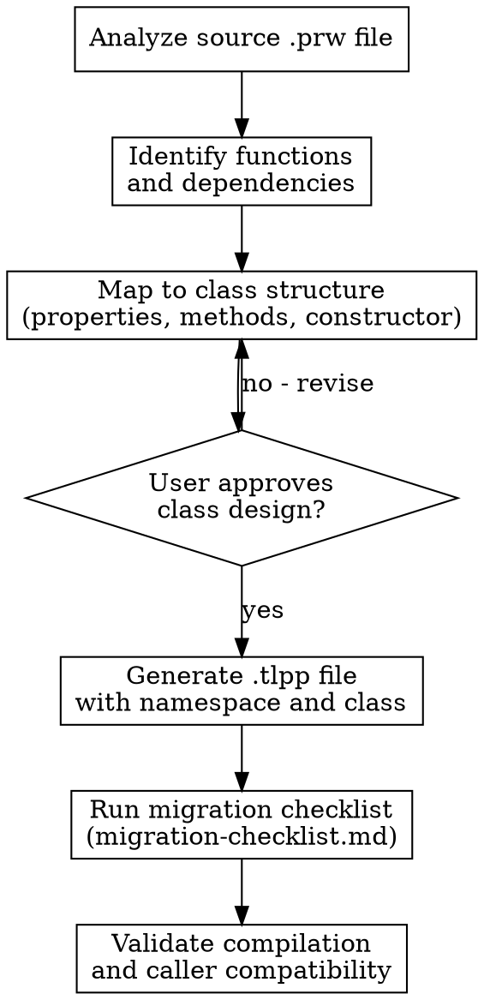

# ADVPL to TLPP Migration

## Overview

Systematic approach for converting legacy ADVPL procedural code to modern TLPP with object-oriented programming patterns. This skill guides the migration process from `.prw` files with User Functions and Static Functions to `.tlpp` files with namespaces, classes, and methods -- while preserving backward compatibility with existing callers.

## When to Use

- Converting procedural ADVPL functions to TLPP classes
- Refactoring User Functions into object-oriented service classes
- Replacing Private/Public variable scoping with class properties
- Modernizing multiple `#Include` directives to TLPP `.th` includes (`tlpp-core.th`, `tlpp-rest.th`, etc.) and adding proper `namespace` declarations
- Migrating Static Functions to private class methods
- Wrapping legacy function calls for backward compatibility during gradual migration
- Any `.prw` to `.tlpp` file conversion

## Migration Strategy



1. **Analyze** the source `.prw` file to understand all functions, variables, and external dependencies
2. **Identify** each User Function and Static Function, their parameters, and shared state
3. **Map** functions to a class structure -- methods, properties, constructor parameters
4. **User approves** the proposed class design before code generation
5. **Generate** the `.tlpp` file with proper namespace, class definition, and method implementations
6. **Run checklist** from `migration-checklist.md` to verify completeness
7. **Validate** that the code compiles and all existing callers still work

## Core Conversion Rules

| ADVPL Construct | TLPP Equivalent | Notes |
|----------------|-----------------|-------|
| `#Include "TOTVS.CH"` | `#Include "tlpp-core.th"` | Use the TLPP-specific includes (`.th` files); `Protheus.ch` is obsolete. Do NOT add `using namespace tlpp.core`, `tlpp.rest`, or `tlpp.log` -- use the `.th` includes instead |
| `User Function Name()` | `namespace custom.module.service; class NameService; method execute()` | Main entry point becomes the primary public method. See namespace conventions below |
| `Static Function Helper()` | `method helper() as private` | Internal functions become private methods |
| `Private cVar := "x"` | `data cVar as character` (class property) | Private variables become class-level data declarations |
| `Public nGlobal` | Remove -- pass via constructor/parameters | Public variables must be eliminated entirely |
| `Local aArray := {}` | Unchanged inside methods | Local variables remain as-is within method bodies |

See `migration-rules.md` for the complete mapping reference covering preprocessor directives, database operations, error handling, and UI elements.

## TLPP Naming Conventions (Official TOTVS Standard)

Follow the official TOTVS naming conventions from TDN (https://tdn.totvs.com/pages/releaseview.action?pageId=633537898).

### Namespaces

All names must be **lowercase**, separated by **dots**, with **no underscores**.

**For TOTVS product code:**
```
totvs.protheus.<segmento>.<agrupador/servico>
```

Available segments: agrobusiness, backoffice, construction, distribution, educational, financial, health, hospitality, legal, manufacturing, retail, services

Examples:
- `totvs.protheus.backoffice.customer`
- `totvs.protheus.backoffice.supplier`
- `totvs.protheus.financial.payment.receive`
- `totvs.protheus.manufacturing.material.balance`

Exceptions: Framework team uses `framework`, Protheus Engineering uses `software.engineering`.

**For client customizations (most common in migrations):**
```
custom.<agrupador>.<servico>
```

Start with `custom.`, the rest is free. Examples:
- `custom.cadastros.cliente`
- `custom.relatorios.customizados`
- `custom.faturamento.pedido`

### File Naming

**For TOTVS product:** `<segmento>.<agrupador/servico>.<funcionalidade>.tlpp`
- Examples: `backoffice.tgv.contact.controller.tlpp`, `financial.payment.receive.tlpp`

**For client customizations:** `custom.<agrupador>.<funcionalidade>.tlpp`
- Examples: `custom.cadastros.cliente.tlpp`, `custom.ma030inc.tlpp`

### Classes, Functions, and Methods

| Element | Convention | Example |
|---------|-----------|---------|
| Classes | **PascalCase** | `ContactsController`, `PedidoService` |
| Functions | **camelCase** | `contactsController()`, `calcTotal()` |
| Methods | **camelCase** | `validName()`, `processOrder()` |

**No underscores** in any identifier.

### Deciding the Namespace

When migrating, ask the user if the code is:
1. **TOTVS product code** -> use `totvs.protheus.<segmento>.<agrupador>`
2. **Client customization** -> use `custom.<agrupador>.<servico>` (this is the most common case)

If the user does not specify, default to `custom.<module>.<service>` pattern.

## Before/After Example

### Before (ADVPL Procedural) -- `CalcPed.prw`

```advpl
#Include "TOTVS.CH"
#Include "TopConn.ch"

/*/{Protheus.doc} CalcPed
Calcula o total de um pedido de venda
@type User Function
@author Dev
@since 01/01/2024
@param cPedido, Caractere, Numero do pedido
@return nTotal, Numerico, Valor total do pedido
/*/
User Function CalcPed(cPedido)
    Local nTotal := 0
    Private cAliasPed := "SC5"
    Private cAliasItens := "SC6"

    Local aArea := GetArea()

    Begin Sequence

        DbSelectArea(cAliasPed)
        DbSetOrder(1)

        If !DbSeek(xFilial(cAliasPed) + cPedido)
            Conout("Pedido nao encontrado: " + cPedido)
            Break
        EndIf

        nTotal := fCalcTotal(cPedido)

    Recover Using oError
        Conout("Erro em CalcPed: " + oError:Description)
        nTotal := 0
    End Sequence

    RestArea(aArea)
Return nTotal

Static Function fCalcTotal(cPedido)
    Local nSoma := 0

    DbSelectArea(cAliasItens)
    DbSetOrder(1)

    DbSeek(xFilial(cAliasItens) + cPedido)
    While !Eof() .And. SC6->C6_NUM == cPedido
        nSoma += SC6->C6_VALOR * SC6->C6_QTDVEN
        DbSkip()
    EndDo

Return nSoma
```

### After (TLPP Object-Oriented) -- `custom.faturamento.pedido.tlpp`

```tlpp
#Include "tlpp-core.th"

namespace custom.faturamento.pedido

class PedidoService

    data cAliasPed   as character
    data cAliasItens as character

    public method new() as object
    public method calcTotal(cPedido as character) as numeric
    private method somaItens(cPedido as character) as numeric

endclass

method new() class PedidoService
    ::cAliasPed   := "SC5"
    ::cAliasItens := "SC6"
return self

method calcTotal(cPedido as character) class PedidoService
    local nTotal := 0
    local aArea  := GetArea()

    begin sequence

        DbSelectArea(::cAliasPed)
        DbSetOrder(1)

        if !DbSeek(xFilial(::cAliasPed) + cPedido)
            FWLogMsg("WARN", , "PedidoService", "calcTotal", , , ;
                "Pedido nao encontrado: " + cPedido)
            break
        endif

        nTotal := ::somaItens(cPedido)

    recover using oError
        FWLogMsg("ERROR", , "PedidoService", "calcTotal", , , ;
            "Erro: " + oError:Description)
        nTotal := 0
    end sequence

    RestArea(aArea)
return nTotal

method somaItens(cPedido as character) class PedidoService
    local nSoma := 0

    DbSelectArea(::cAliasItens)
    DbSetOrder(1)

    DbSeek(xFilial(::cAliasItens) + cPedido)
    while !Eof() .And. (::cAliasItens)->(C6_NUM) == cPedido
        nSoma += (::cAliasItens)->(C6_VALOR) * (::cAliasItens)->(C6_QTDVEN)
        DbSkip()
    enddo

return nSoma
```

### Backward Compatibility Wrapper -- `CalcPed.prw` (preserved)

```advpl
#Include "TOTVS.CH"

/*/{Protheus.doc} CalcPed
Wrapper de compatibilidade - delega para PedidoService (TLPP)
@type User Function
@author Dev
@since 01/01/2024
@param cPedido, Caractere, Numero do pedido
@return nTotal, Numerico, Valor total do pedido
/*/
User Function CalcPed(cPedido)
    Local oService := custom.faturamento.pedido.PedidoService():new()
Return oService:calcTotal(cPedido)
```

## Key Migration Decisions

| Decision | Guideline |
|----------|-----------|
| One class per file | Each `.tlpp` file should contain a single class with a clear responsibility |
| Namespace = official TOTVS convention | For customizations use `custom.<agrupador>.<servico>` (e.g., `custom.faturamento.pedido`). For TOTVS product use `totvs.protheus.<segmento>.<agrupador>`. All lowercase, no underscores, separated by dots |
| User Function preserved as wrapper | Keep the original `.prw` User Function as a thin wrapper that delegates to the new class |
| Gradual migration | Migrate one function group at a time; wrappers ensure existing callers are not broken |
| Constructor for shared state | Values that were previously `Private`/`Public` variables shared across functions should be passed through the constructor or set as class properties |
| Logging over Conout | Prefer `FWLogMsg()` or `FWLogError()` over raw `Conout()` in TLPP classes |

## Common Mistakes

| Mistake | Consequence | Fix |
|---------|-------------|-----|
| Removing User Function without wrapper | Breaks all external callers (`u_FuncName`) | Always keep a `.prw` wrapper during migration |
| Using `Private` variables inside methods | Variables leak to called methods unexpectedly | Convert to class `data` properties or `Local` variables |
| Forgetting `::` prefix for class properties | References undefined local variable instead of property | Always use `::propertyName` inside methods |
| Putting multiple classes in one `.tlpp` file | Hard to maintain, namespace confusion | One class per file |
| Not preserving `GetArea()`/`RestArea()` | Database cursor state corrupted for callers | Always save and restore area in methods that access DB |
| Skipping `xFilial()` after migration | Multi-branch queries return wrong data | Always use `xFilial(cAlias)` in `DbSeek` operations |
| Ignoring Static variables used across functions | Shared state lost when functions become methods | Convert `Static` variables to class `data` properties |

## References

- `migration-rules.md` -- Complete mapping of all ADVPL constructs to TLPP equivalents
- `migration-checklist.md` -- Step-by-step checklist for executing and validating a migration
