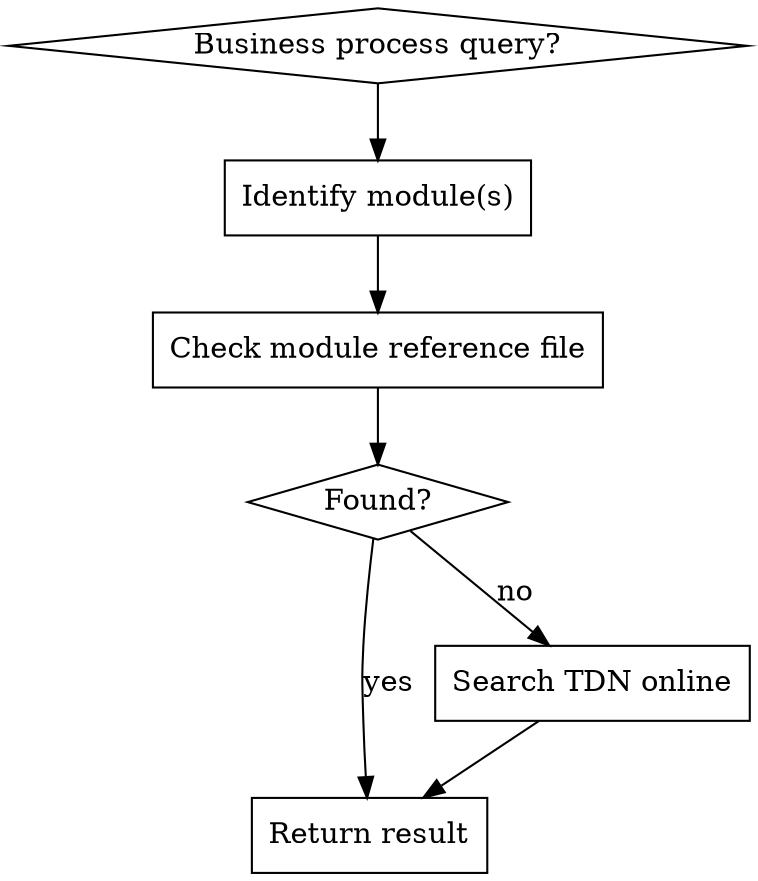

# Protheus Business Processes

## Overview

Reference guide for TOTVS Protheus ERP business processes. Provides understanding of how each module works, its routines, tables, business rules, and how modules integrate with each other.

## When to Use

- Understanding business processes within a Protheus module
- Looking up module functions, routines, and workflows
- Finding which tables and fields a process uses
- Understanding ERP integrations between modules
- Questions like "how does faturamento work?", "what tables does compras use?", "how do compras and estoque integrate?"

## Module Index

| Module | Prefix | Reference File |
|--------|--------|----------------|
| Compras | COM | modulo-compras.md |
| Estoque | EST | modulo-estoque.md |
| Faturamento | FAT | modulo-faturamento.md |
| Financeiro | FIN | modulo-financeiro.md |
| Contabilidade | CTB | modulo-contabilidade.md |
| Fiscal | FIS | modulo-fiscal.md |
| PCP | PCP | modulo-pcp.md |
| Manutencao de Ativos | MNT | modulo-manutencao.md |

## Lookup Strategy

1. **Identify module(s):** Determine which module(s) the query relates to using the Module Index above
2. **Local first:** Check the corresponding module reference file (e.g., modulo-compras.md)
3. **Online fallback:** Search TDN using query: `site:tdn.totvs.com <module> <process> protheus`

## Response Format

Adaptive based on query type:

| Query Type | Response Structure |
|------------|-------------------|
| Process | Description -> Routines -> Tables/Fields -> Step-by-step flow -> Integrations -> Entry points |
| Routine | What it does -> Tables it moves -> Parameters -> Process it belongs to |
| Module | Overview -> Main tables -> Main routines -> Key processes -> Integrations |
| Integration | Flow between modules -> Linking tables -> Routines involved |

## Online Search Tips

When searching TDN (TOTVS Developer Network):
- Search with query: `site:tdn.totvs.com <module> <process> protheus`
- For routine docs: `site:tdn.totvs.com <routine_name> advpl protheus`
- For module integration: `site:tdn.totvs.com integracao <module_a> <module_b> protheus`
- TDN base URL: `https://tdn.totvs.com`

## Cross-References

- **protheus-reference** — for native function details (syntax, parameters, return values)
- **advpl-code-generation** — for code patterns and templates
- **embedded-sql** — for query examples using Embedded SQL
