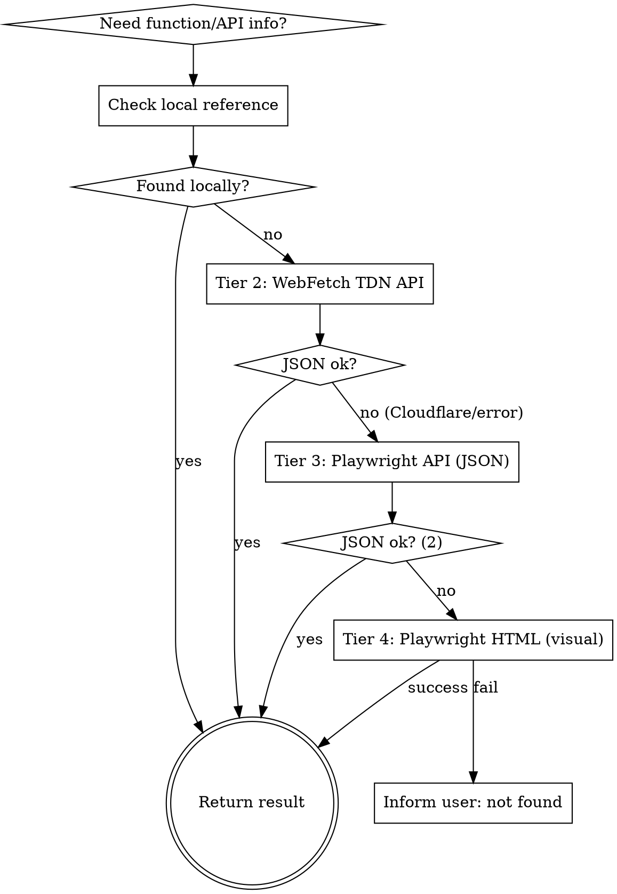

# Protheus Reference

## Overview

Reference guide for the TOTVS Protheus ecosystem. Provides quick access to native functions, data dictionary (SX tables), REST API endpoints, and system parameters (MV_*).

## When to Use

- Looking up native function syntax, parameters, or return values
- Understanding SX data dictionary structure (SX1 through SX9, SIX)
- Finding REST API endpoints for Protheus integration
- Checking MV_* parameter purpose and default values
- Understanding .ini configuration files (appserver.ini, smartclient.ini)

## Lookup Strategy



1. **Local first:** Check supporting files (native-functions.md, sx-dictionary.md, rest-api-reference.md)
2. **Tier 2 — WebFetch na API REST do Confluence:** Executar `WebFetch` na URL:
   ```
   https://tdn.totvs.com/rest/api/search?cql=type%3Dpage%20AND%20title%3D%22<TERMO>%22%20AND%20space%20IN%20(%22tec%22%2C%22framework%22)&expand=body.view&limit=3
   ```
   Se retornar JSON válido com `size > 0`: extrair `results[0].content.title`, `results[0].excerpt`, `results[0].url` e `results[0].content.body.view.value` (HTML do conteúdo). Parsear o HTML para extrair Descrição, Sintaxe, Parâmetros, Retorno, Exemplo. Se `size == 0` → repetir com busca fuzzy: `title~"<TERMO>"` (sem filtro de space). Se falhar (403 Cloudflare, timeout, HTML em vez de JSON) → Tier 3.
3. **Tier 3 — Playwright na API REST (JSON):** `browser_navigate` → mesma URL do Tier 2. `browser_snapshot` → extrair JSON como texto. Parsear com mesmo processo do Tier 2. Se `size == 0` → repetir com fuzzy. Se falhar → Tier 4.
4. **Tier 4 — Playwright na página visual (último recurso):** Se tem `url` dos tiers anteriores: `browser_navigate` → `https://tdn.totvs.com{url}`. Se não tem URL: `browser_navigate` → `https://tdn.totvs.com`, `browser_fill_form` → buscar o termo, `browser_click` → disparar busca. `browser_snapshot` → extrair conteúdo. Se insuficiente → `browser_take_screenshot`.
5. **Limpeza:** Sempre executar `browser_close` ao finalizar Tier 3 ou 4, independentemente de sucesso ou falha.

## CRITICAL: Restricted Functions Check

**Before recommending any function, ALWAYS check if it appears in `restricted-functions.md`.** TOTVS maintains a list of 195+ functions/classes that are internal property and MUST NOT be used in custom code. Some have their compilation blocked since release 12.1.33.

See `restricted-functions.md` for the complete list and supported alternatives.

## Function Categories

| Category | Common Functions | File Reference |
|----------|-----------------|----------------|
| String | Alltrim, SubStr, StrTran, Pad*, Upper, Lower | native-functions.md |
| Date/Time | dDataBase, DtoS, StoD, Day, Month, Year | native-functions.md |
| Array | aAdd, aDel, aSize, aScan, aSort, aClone | native-functions.md |
| Database | DbSelectArea, DbSetOrder, DbSeek, RecLock, MsUnlock | native-functions.md |
| Interface | MsgInfo, MsgYesNo, MsgAlert, FWExecView, Enchoice | native-functions.md |
| File I/O | FOpen, FRead, FWrite, FClose, FErase, Directory | native-functions.md |
| Network | HttpGet, HttpPost, FWRest, WsRestFul | native-functions.md |
| System | GetMV, PutMV, SuperGetMV, Conout, FWLogMsg | native-functions.md |
| Company/Branch | FWCodFil, FWCodEmp, FWFilial, FWCompany, xFilial | native-functions.md |
| JsonObject | New, FromJSON, toJSON, GetNames, HasProperty, GetJsonObject, GetJsonText, GetJsonValue, DelName, Set | native-functions.md |
| TWsdlManager | New, ParseURL, ParseFile, SetOperation, SendSoapMsg, GetParsedResponse, GetSoapResponse, GetSoapMsg, ListOperations, SetPort, SetValue | native-functions.md |
| Browse/UI | FwBrowse, FWMarkBrowse, FWBrwColumn, FWBrwRelation, FWLegend, FWCalendar, FWSimpEdit | native-functions.md |
| Process | FWGridProcess, tNewProcess | native-functions.md |
| WorkArea | FwGetArea, FwRestArea | native-functions.md |
| User | FwGetUserName, UsrRetName | native-functions.md |
| Dialog | FWMsgRun, FWInputBox | native-functions.md |
| Memory | FWFreeObj, FWFreeVar | native-functions.md |
| Date ISO | Fw8601ToDate, FWDateTo8601 | native-functions.md |
| URL Encode | FWHttpEncode, FWURIDecode | native-functions.md |
| Semaphore | MayIUseCode, MPCriaNumS | native-functions.md |
| Dictionary | FWX3Titulo, FWX2CHAVE, FWX2Unico | native-functions.md |
| Interface | SaveInter, RestInter | native-functions.md |
| ExecAuto | MsGetDAuto, MsExecAuto, FWMVCRotAuto | native-functions.md |
| Restricted | StaticCall, PTInternal, PARAMBOX, etc. | restricted-functions.md |

## Data Dictionary Quick Reference

| Table | Purpose |
|-------|---------|
| SX1 | Perguntas (parameters for reports/routines) |
| SX2 | Tabelas (table definitions) |
| SX3 | Campos (field definitions) |
| SX5 | Tabelas genericas (generic lookup tables) |
| SX6 | Parametros (MV_* system parameters) |
| SX7 | Gatilhos (field triggers) |
| SX9 | Relacionamentos (table relationships) |
| SXB | Consultas padrao (standard queries) |
| SIX | Indices (index definitions) |

See `sx-dictionary.md` for complete structure with field descriptions.

## REST API Patterns

Protheus REST APIs follow two main patterns:

1. **FWRest Framework** (newer): Annotation-based with `@Get`, `@Post`, `@Put`, `@Delete`
2. **WsRestFul** (legacy): Class-based with `wsmethod`

See `rest-api-reference.md` for endpoint patterns and authentication.

## TDN API Reference

O TDN (tdn.totvs.com) roda sobre Confluence Data Center 7.19 e expõe a API REST v1 publicamente sem autenticação.

**Endpoint principal:**
```
GET /rest/api/search?cql=<CQL_ENCODADO>&expand=body.view&limit=3
```

**CQL patterns por tipo de consulta:**

| Tipo | CQL título exato | CQL fuzzy (fallback) |
|------|------------------|----------------------|
| Função | `type=page AND title="FWExecView" AND space IN ("tec","framework")` | `type=page AND title~"FWExecView"` |
| Parâmetro MV | `type=page AND title="MV_ESTADO"` | `type=page AND title~"MV_ESTADO"` |
| Tabela SX | `type=page AND title~"SX3" AND space="tec"` | `type=page AND text~"SX3 dicionario"` |
| API REST | `type=page AND text~"rest api {endpoint}" AND space IN ("tec","framework")` | `type=page AND text~"rest api {endpoint}"` |
| Entry point | `type=page AND title="{EP_NAME}" AND space IN ("tec","framework")` | `type=page AND text~"{EP_NAME}"` |
| Erro | `type=page AND text~"{erro}" AND space IN ("tec","framework")` | `type=page AND text~"{erro}"` |
| Rotina | `type=page AND title~"{MATA410}"` | `type=page AND text~"{MATA410} protheus"` |

**Extração de dados do JSON:**
```
results[i].content.title       → Título da página
results[i].excerpt             → Resumo em texto puro
results[i].url                 → Path relativo (para Tier 4: https://tdn.totvs.com{url})
results[i].content.body.view.value → HTML do conteúdo (Descrição, Sintaxe, Parâmetros, Retorno, Exemplo)
```

**Detecção de Cloudflare:** Se o body contém "Attention Required" ou "cf-browser-verification", ou status HTTP = 403 → ir para Tier 3 (Playwright na API).

**Spaces conhecidos:** `tec` (funções nativas), `framework` (framework MVC/REST).
