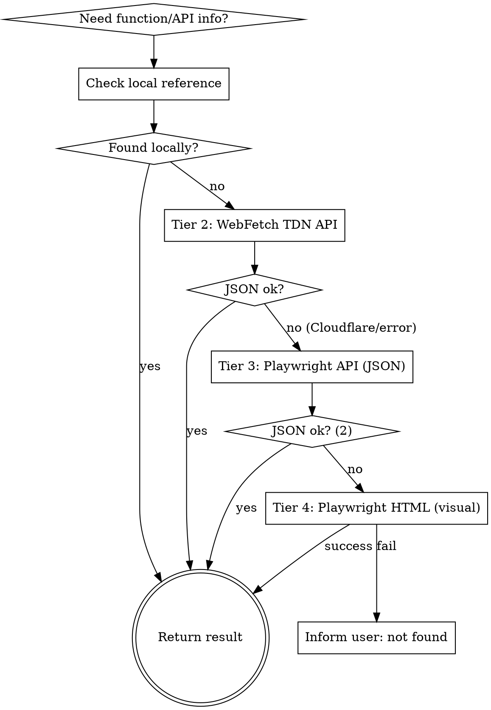

# Protheus Reference

## Overview

Reference guide for the TOTVS Protheus ecosystem. Provides quick access to native functions, data dictionary (SX tables), REST API endpoints, and system parameters (MV_*).

## When to Use

- Looking up native function syntax, parameters, or return values
- Understanding SX data dictionary structure (SX1 through SX9, SIX)
- Finding REST API endpoints for Protheus integration
- Checking MV_* parameter purpose and default values
- Understanding .ini configuration files (appserver.ini, smartclient.ini)

## Lookup Strategy

1. **Local first:** Check supporting files (native-functions.md, sx-dictionary.md, rest-api-reference.md)
2. **Online fallback:** Load skill `tdn-lookup` e seguir a estratégia de busca em 3 tiers (Tier 2: WebFetch API → Tier 3: Playwright API JSON → Tier 4: Playwright HTML visual). Consultar a tabela de CQL na seção "TDN API Reference" abaixo.
3. **Field validation:** Para validar campos SX3: (1) Verificar `sx3-common-fields.md` (referência local com ~15 campos das 21 tabelas principais). (2) Se não encontrar, WebFetch em `https://sempreju.com.br/tabelas_protheus/tabelas/tabela_{alias_lowercase}.html`. (3) Se não encontrar, perguntar ao usuário. NUNCA inventar campo.

## CRITICAL: Restricted Functions Check

**Before recommending any function, ALWAYS check if it appears in `restricted-functions.md`.** TOTVS maintains a list of 195+ functions/classes that are internal property and MUST NOT be used in custom code. Some have their compilation blocked since release 12.1.33.

See `restricted-functions.md` for the complete list and supported alternatives.

## Function Categories

| Category | Common Functions | File Reference |
|----------|-----------------|----------------|
| String | Alltrim, SubStr, StrTran, Pad*, Upper, Lower | native-functions.md |
| Date/Time | dDataBase, DtoS, StoD, Day, Month, Year | native-functions.md |
| Array | aAdd, aDel, aSize, aScan, aSort, aClone | native-functions.md |
| Database | DbSelectArea, DbSetOrder, DbSeek, RecLock, MsUnlock | native-functions.md |
| Interface | MsgInfo, MsgYesNo, MsgAlert, FWExecView, Enchoice | native-functions.md |
| File I/O | FOpen, FRead, FWrite, FClose, FErase, Directory | native-functions.md |
| Network | HttpGet, HttpPost, FWRest, WsRestFul | native-functions.md |
| System | GetMV, PutMV, SuperGetMV, Conout, FWLogMsg | native-functions.md |
| Company/Branch | FWCodFil, FWCodEmp, FWFilial, FWCompany, xFilial | native-functions.md |
| JsonObject | New, FromJSON, toJSON, GetNames, HasProperty, GetJsonObject, GetJsonText, GetJsonValue, DelName, Set | native-functions.md |
| TWsdlManager | New, ParseURL, ParseFile, SetOperation, SendSoapMsg, GetParsedResponse, GetSoapResponse, GetSoapMsg, ListOperations, SetPort, SetValue | native-functions.md |
| Browse/UI | FwBrowse, FWMarkBrowse, FWBrwColumn, FWBrwRelation, FWLegend, FWCalendar, FWSimpEdit | native-functions.md |
| Process | FWGridProcess, tNewProcess | native-functions.md |
| WorkArea | FwGetArea, FwRestArea | native-functions.md |
| User | FwGetUserName, UsrRetName | native-functions.md |
| Dialog | FWMsgRun, FWInputBox | native-functions.md |
| Memory | FWFreeObj, FWFreeVar | native-functions.md |
| Date ISO | Fw8601ToDate, FWDateTo8601 | native-functions.md |
| URL Encode | FWHttpEncode, FWURIDecode | native-functions.md |
| Semaphore | MayIUseCode, MPCriaNumS | native-functions.md |
| Dictionary | FWX3Titulo, FWX2CHAVE, FWX2Unico | native-functions.md |
| Interface | SaveInter, RestInter | native-functions.md |
| ExecAuto | MsGetDAuto, MsExecAuto, FWMVCRotAuto | native-functions.md |
| Restricted | StaticCall, PTInternal, PARAMBOX, etc. | restricted-functions.md |

## Data Dictionary Quick Reference

| Table | Purpose |
|-------|---------|
| SX1 | Perguntas (parameters for reports/routines) |
| SX2 | Tabelas (table definitions) |
| SX3 | Campos (field definitions) |
| SX5 | Tabelas genericas (generic lookup tables) |
| SX6 | Parametros (MV_* system parameters) |
| SX7 | Gatilhos (field triggers) |
| SX9 | Relacionamentos (table relationships) |
| SXB | Consultas padrao (standard queries) |
| SIX | Indices (index definitions) |

See `sx-dictionary.md` for complete structure with field descriptions.

## REST API Patterns

Protheus REST APIs follow two main patterns:

1. **FWRest Framework** (newer): Annotation-based with `@Get`, `@Post`, `@Put`, `@Delete`
2. **WsRestFul** (legacy): Class-based with `wsmethod`

See `rest-api-reference.md` for endpoint patterns and authentication.

## TDN API Reference

Consultar skill `tdn-lookup` para a estratégia completa, CQL patterns, extração de dados JSON, detecção de Cloudflare e informações técnicas do TDN.
